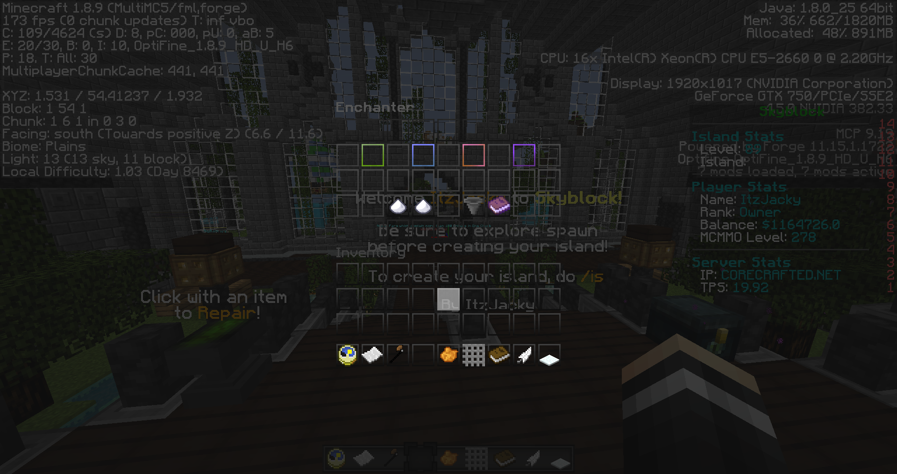
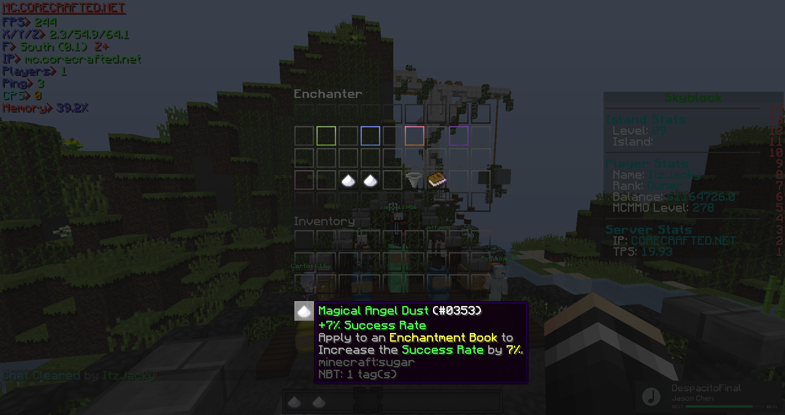
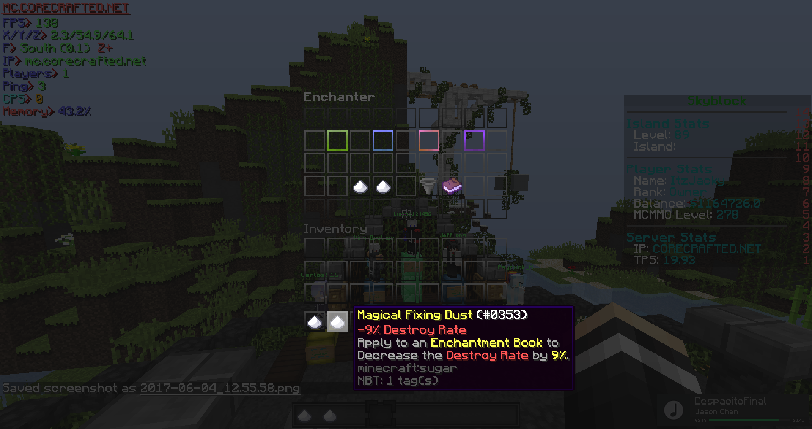

Custom Enchants
================

Tiering
--------
There are a total 4 tiers of Custom Enchants:

- Common           Cost:1500XP Point
- Epic             Cost:5000XP Point
- Royal            Cost:12500XP Point
- Legendary        Cost:25000XP Point

Commands
--------
- To open up the Tinkerer, type ``/Tinker``
- To open the Custom Enchants GUI , type ``/CE``  or ``/Enchanter``

Rate
----
- Dust [#]_ can be bought from the shop with Money or tinkering items with enchants
- Angel Dust can increase the success rate of the enchanted book
- Fixing Dust can decrease the destroy rate of the enchanted book

.. [#] Dust can be bought from the Custom Enchants Menu
