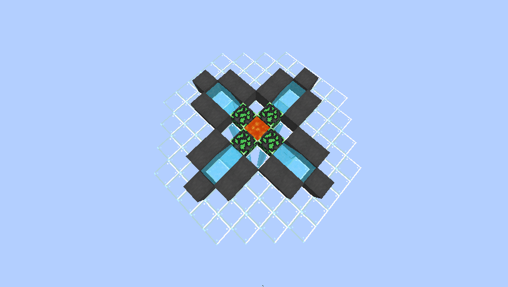

Island management
==================

Player
------
- To claim your own island , type ``/is``
- For going back to your island, type ``/is go``
- To calculate your island level, type ``/is level``
- To join/invite another player , you need an invitation from them ``/is invite [playername]`` ,then type ``/is accept [Inviter]`` once you receive the invitation
- To visit another player's island , type ``/is warp [playername]`` (They need to have a warp sign setted up!)
- (layout of the welcome sign): ::

    [Welcome]
    <Description>

- To ban a player from your island, type ``/is ban [playername]``
- To temp. kick a player from your island, type ``/is expel [playername]``
- To lock/unlock your island, type ``/is lock``
- To join/leave island chat, type ``/is teamchat``

Chest Protection
-----------------
- To Lock a chest / container, right click the chest you want to lock with a SIGN
- To grant access to everyone , place a SIGN on another side of the chest
- To grant access to a specific player, place a SIGN on another side of the chest with: ::

    [Private]
    <Playername>
    <AnotherPlayername>
    <MorePlayername>

- To grant more player than just 3, please an additional sign on the container as following: ::

    [More Users]
    <EvenMorePlayername>
    <YetAnotherPlayer>
    <Player>

Cobble Generator
----------------
- To Build a cobble gen , simply copy the design at the Shop [#]_
- An Advanced Version for 4 players mining together

- Cobble Gen will generate random ores(Higher Tier Ores are Rarer! Obviously!!!)!

.. [#] Shop can be accessed with /warp shop or by walking from Spawn
